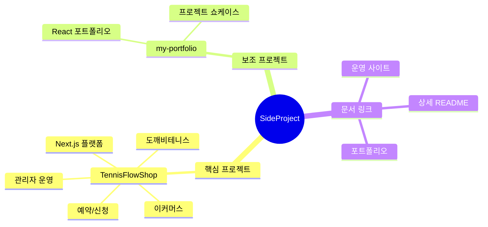

  

# SideProject Portfolio Hub

이 저장소는 포트폴리오용 사이드 프로젝트를 모아 둔 프로젝트 허브입니다. 핵심 프로젝트는 **TennisFlowShop 폴더에 구현된 “도깨비테니스”**이며, 테니스 상품 탐색·주문·예약·관리자 운영 흐름을 하나의 Next.js 서비스로 구성했습니다.

## 바로가기

| 구분 | 링크 | 설명 |
| --- | --- | --- |
| 핵심 프로젝트 상세 | [TennisFlowShop/README.md](./TennisFlowShop/README.md) | 도깨비테니스 기능, 아키텍처, 운영 관점 정리 |
| 운영 사이트 | [https://dokkaebitennis.com](https://dokkaebitennis.com) | 현재 코드/문서에서 사용하는 도깨비테니스 canonical 운영 도메인 |
| 보조 프로젝트 | [my-portfolio](./my-portfolio) | 개인 포트폴리오 웹 프로젝트 |

## 프로젝트 목록

| 프로젝트 | 역할 | 기술/키워드 | 포트폴리오 포인트 |
| --- | --- | --- | --- |
| **TennisFlowShop / 도깨비테니스** | 메인 프로젝트 | Next.js, TypeScript, MongoDB, Supabase Storage, 결제, 관리자 | 이커머스·예약·커뮤니티·관리자 운영을 연결한 실서비스형 플랫폼 |
| **my-portfolio** | 보조 프로젝트 | Vite, React | 개인 소개와 프로젝트 쇼케이스를 위한 프론트엔드 포트폴리오 |

<strong>도깨비테니스에서 확인할 수 있는 역량</strong>

- 사용자 관점: 상품 탐색, 스트링 추천, 주문/결제, 레슨 신청, 리뷰/커뮤니티 경험 설계
- 관리자 관점: 상품·주문·신청·리뷰·정산 운영 화면과 운영 알림 흐름 구성
- 운영 관점: 환경변수, 배포 스모크 체크, 관리자 E2E 우회 정책, 운영 문서화
- 포트폴리오 관점: 서비스 소개 README, 실제 운영 URL, 상세 기능/아키텍처 문서 분리

## 저장소 구조 한눈에 보기

## README 역할 분리

- **루트 README**: 저장소 전체를 빠르게 이해할 수 있는 포트폴리오 허브입니다.
- **TennisFlowShop README**: 도깨비테니스의 문제 정의, 기능, 사용자/관리자 플로우, 기술 구성, 운영 품질을 설명하는 상세 소개 문서입니다.
- **my-portfolio README**: 보조 프로젝트의 기본 안내 문서입니다.

## 다음에 보강하면 좋은 자료

- 도깨비테니스 메인 화면, 상품 상세, 관리자 대시보드 스크린샷
- 주문/예약/관리자 처리 흐름을 보여주는 짧은 GIF
- 운영 지표 또는 개선 전후 비교 이미지
