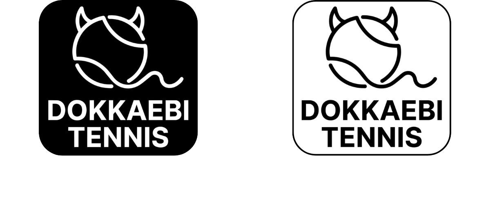

  

# SideProject Portfolio Hub

이 저장소의 메인 프로젝트는 **도깨비테니스**입니다. 테니스 상품 이커머스와 서비스 신청부터 주문·결제, 관리자 운영까지 하나의 데이터 흐름으로 연결한 실서비스형 Next.js 프로젝트입니다.

## 바로 체험하기

| 우선순위 | 링크 | 안내 |
| --- | --- | --- |
| **1. Portfolio Demo · 채용 담당자 체험 권장** | **[demo.dokkaebitennis.com](https://demo.dokkaebitennis.com)** | 별도 Demo 데이터 환경에서 고객 기능과 조회 전용 관리자 화면 체험 |
| 2. Production | [www.dokkaebitennis.com](https://www.dokkaebitennis.com) | 실제 운영 사이트이므로 테스트 데이터 생성이나 불필요한 조작은 권장하지 않음 |
| 3. Project README | [TennisFlowShop/README.md](./TennisFlowShop/README.md) | 기능, Demo 정책, 아키텍처와 품질 검증 상세 |

Portfolio Demo에서는 고객 기능을 직접 체험할 수 있습니다. 실제 결제는 발생하지 않고 체험 데이터는 24시간 후 정리됩니다. 관리자 Demo는 조회 전용이며, 자세한 안전 정책은 [도깨비테니스 README](./TennisFlowShop/README.md)에서 확인할 수 있습니다.

## 이 저장소에서 확인할 수 있는 핵심 역량

- 고객의 주문·신청과 관리자 처리 화면을 연결하는 도메인 및 상태 설계
- 상품, 스트링 교체서비스, 라켓 대여, 패키지, 아카데미를 포함한 서비스 구현
- 주문·신청·대여·패키지 업무를 모아 보는 관리자 Operations와 상세 운영 화면
- 같은 코드베이스에서 Production과 상호작용 가능한 Demo 환경의 데이터·정책 분리
- 관리자 Demo의 UI 제한과 서버 mutation 차단, 실제 결제 차단, 임시 데이터 수명 관리
- lint, typecheck, build, contract, 관리자 경계 및 핵심 관리자 smoke를 포함한 CI 품질 Gate

## 프로젝트 목록

| 프로젝트 | 상태와 역할 | 기술 및 현재 범위 |
| --- | --- | --- |
| **[TennisFlowShop / 도깨비테니스](./TennisFlowShop/README.md)** | **Main Project** · 이커머스, 서비스 신청, 관리자 운영 · Portfolio Demo 제공 | Next.js, React, TypeScript, MongoDB, Supabase Storage |
| **[TossMiniApp](./TossMiniApp/README.md)** | 도깨비테니스 Apps in Toss 전용 프론트엔드 | React + TypeScript + Vite 기반, 현재 초기 안내 화면과 모바일 우선 레이아웃까지 구현 |
| **[shalom-house](./shalom-house/README.md)** | 샬롬의 집 공식 홈페이지 프로젝트 | 시설 정보, 생활 기록, 소식, 참여 절차, 공개 자료, 연락·방문 안내를 제공하며 공개 전 운영자 검토가 필요한 콘텐츠 포함 |
| **[my-portfolio](./my-portfolio/README.md)** | 개인 포트폴리오 웹 프로젝트 | React + Vite 기반의 개인 소개 및 프로젝트 프론트엔드 |

## README 안내

- 이 문서는 저장소 전체를 빠르게 탐색하는 Portfolio Hub입니다.
- 메인 프로젝트의 구현 범위와 체험 방법은 [TennisFlowShop/README.md](./TennisFlowShop/README.md)에 정리되어 있습니다.
- 각 보조 프로젝트의 완료 범위와 실행 방법은 해당 프로젝트 README를 기준으로 확인해 주세요.
