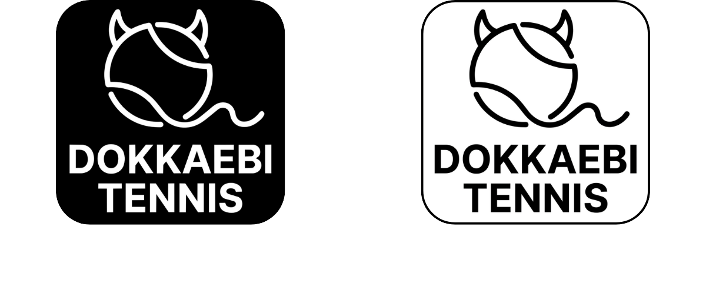
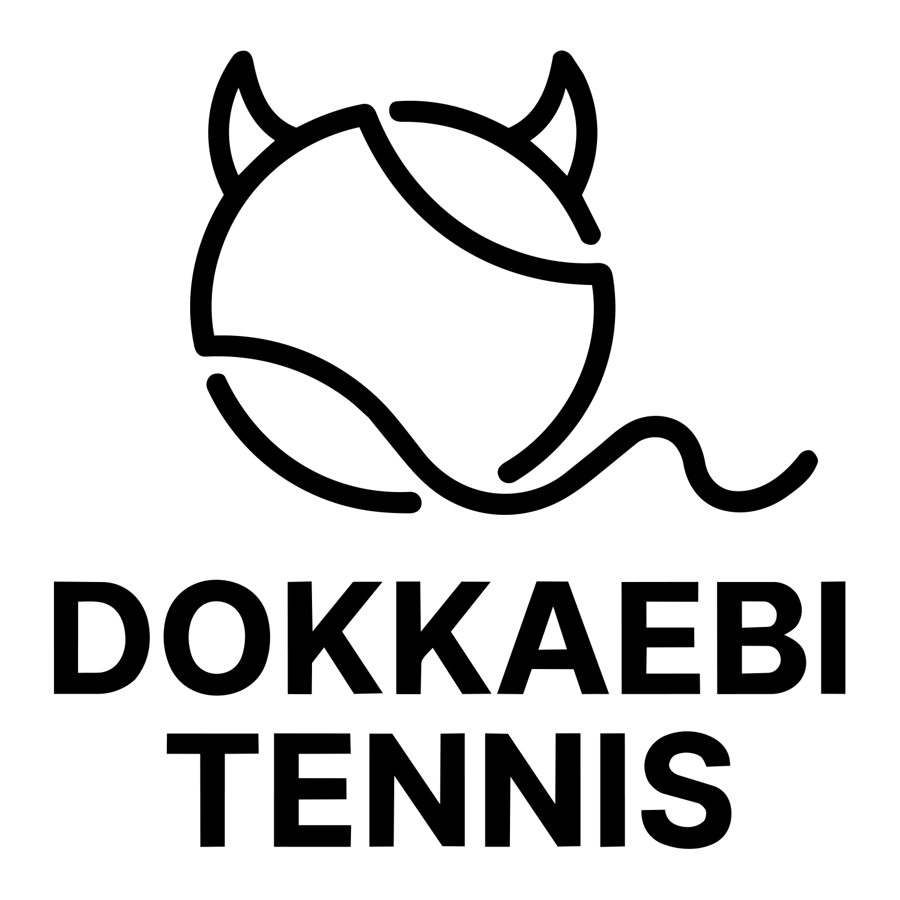
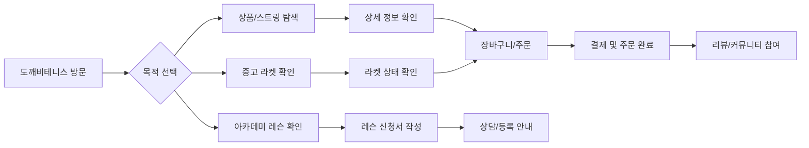
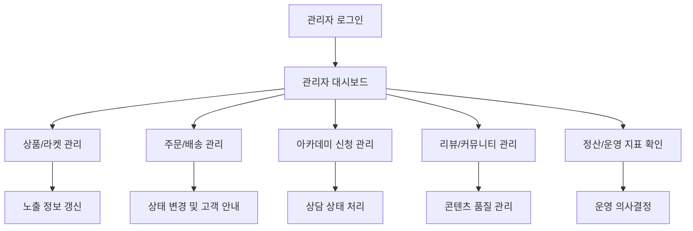
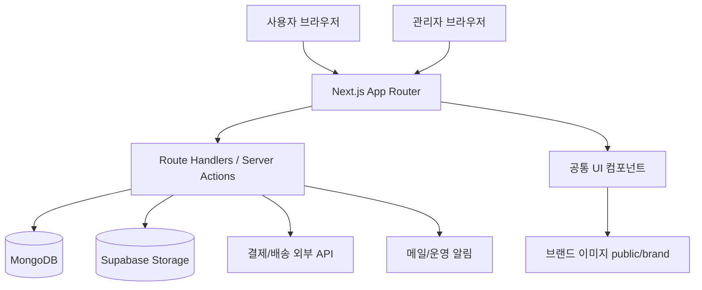

<p align="center">
  
</p>

# 도깨비테니스


**도깨비테니스**는 테니스 용품 구매, 스트링 교체, 아카데미 신청, 중고 라켓 탐색, 리뷰/커뮤니티, 관리자 운영을 하나로 연결한 **Next.js 기반 테니스 이커머스·예약·관리자 운영 플랫폼**입니다.

- 운영 사이트: [https://www.dokkaebitennis.com](https://www.dokkaebitennis.com)
- 저장소 폴더명: `TennisFlowShop`
- 개발자: 윤형섭

> 운영 URL은 현재 정상 접근이 확인된 `www` 도메인 기준으로 정리했습니다. 배포 환경이 변경되면 `NEXT_PUBLIC_SITE_URL`과 함께 이 README의 링크도 갱신해야 합니다.

## Overview

도깨비테니스는 단순 상품 판매 페이지가 아니라, 테니스 고객의 실제 여정을 기준으로 구성된 서비스입니다. 사용자는 상품을 탐색하고, 스트링 추천/교체를 확인하고, 레슨을 신청하고, 리뷰와 커뮤니티를 통해 후기를 남길 수 있습니다. 관리자는 주문·상품·신청·리뷰·정산 흐름을 한곳에서 운영할 수 있습니다.

<p align="center">
  
</p>

## Why this project

- 테니스 매장/아카데미 운영에서 반복되는 **상담, 주문, 신청, 후기 관리**를 웹 서비스로 구조화하기 위해 만들었습니다.
- 사용자는 여러 채널을 오가지 않고 상품, 레슨, 문의, 리뷰를 한 서비스 안에서 확인할 수 있습니다.
- 관리자는 운영 데이터를 흩어진 메시지나 스프레드시트가 아니라 관리자 화면 중심으로 다룰 수 있습니다.
- 포트폴리오 관점에서는 프론트엔드 UI뿐 아니라 인증, 결제, 파일 업로드, 관리자 정책, 운영 문서화까지 경험한 프로젝트입니다.

## Key Features

| 영역          | 주요 기능                                       | 사용자 가치                               |
| ------------- | ----------------------------------------------- | ----------------------------------------- |
| 쇼핑          | 상품 목록/상세, 스트링 추천, 장바구니/주문 흐름 | 필요한 테니스 용품을 빠르게 비교하고 구매 |
| 예약/신청     | 아카데미 레슨 신청, 스트링 교체 접수            | 상담 전 필요한 정보를 구조화해 전달       |
| 중고 라켓     | 도깨비 인증 중고 라켓 탐색                      | 신뢰 기반 중고 장비 구매 경험             |
| 리뷰/커뮤니티 | 후기 작성, 이미지 업로드, 게시판 흐름           | 구매/이용 경험 공유                       |
| 관리자        | 상품, 주문, 신청, 리뷰, 정산, 운영 알림         | 운영자가 서비스 상태를 통합 관리          |

<details>
<summary><strong>기능 상세 보기</strong></summary>

- 고객 홈: 브랜드 메시지, 추천 상품, 중고 라켓, 스트링/아카데미 진입점 제공
- 상품 도메인: 상품 카드, 필터, 상세, 추천 도우미, 주문/결제 진입
- 아카데미 도메인: 클래스 안내, 레슨 신청, 신청 완료 페이지
- 관리자 도메인: 대시보드, 상품 등록/수정, 주문/배송, 아카데미 클래스/신청 관리, 리뷰 관리, 정산 스냅샷
- 운영 도메인: 스모크 체크 문서, 관리자 우회 정책, 알림/보안 관련 유틸

</details>

## User/Admin Flow

### 사용자 플로우



### 관리자 플로우



## Tech Stack

| 분류       | 기술                                   |
| ---------- | -------------------------------------- |
| Framework  | Next.js App Router                     |
| Language   | TypeScript                             |
| Styling    | Tailwind CSS                           |
| Data       | MongoDB, Supabase Storage              |
| Payment    | Toss Payments, NICE Payments 연동 코드 |
| E2E/Smoke  | Cypress, 운영 스모크 스크립트          |
| Deployment | Vercel 기준 운영 문서                  |

<details>
<summary><strong>기술 선택 이유</strong></summary>

- Next.js App Router로 공개 페이지와 관리자 페이지를 같은 프로젝트 안에서 관리했습니다.
- TypeScript로 상품, 주문, 신청, 관리자 화면의 데이터 흐름을 명확히 다루도록 구성했습니다.
- MongoDB는 서비스 도메인 데이터 저장에, Supabase Storage는 상품/리뷰 이미지 업로드 흐름에 활용했습니다.
- 결제, 배송 조회, 알림, 보안 유틸을 분리해 운영 기능이 화면 코드에 과도하게 섞이지 않도록 관리했습니다.

</details>

## Project Structure

```text
TennisFlowShop/
├─ app/                 # 사용자/관리자 라우트와 페이지
├─ components/          # 공통 UI, 헤더/푸터, 관리자 컴포넌트
├─ lib/                 # 인증, 결제, 데이터, 보안, 운영 유틸
├─ docs/                # 운영/검증/정책 문서
├─ cypress/             # E2E 테스트 스펙
├─ scripts/             # 스모크 및 운영 보조 스크립트
└─ public/              # 브랜드 이미지, 배너, 플레이스홀더
```

## Architecture Snapshot



## Quality & Operation

<details open>
<summary><strong>운영 품질을 위해 정리한 내용</strong></summary>

- 관리자 진입점과 관리자 대시보드 리다이렉트 정책 문서화
- 로컬/스테이징/운영 환경별 점검 흐름 정리
- 배포 후 공개 경로 스모크 체크와 주요 E2E 스펙 운영 가이드 작성
- 운영 URL, Function region, 런타임 인덱스, 첨부 URL 정책 등 운영 문서 유지
- 테스트 전용 관리자 우회 조건을 환경변수와 헤더 기준으로 제한

</details>

## Local Development

> 이 섹션은 프로젝트 실행 안내입니다. 실제 secret 값은 저장소에 커밋하지 않습니다.

```bash
pnpm install
cp .env.example .env.local
pnpm dev
```

주요 스크립트는 다음과 같습니다.

```bash
pnpm lint       # ESLint
pnpm typecheck  # tsc --noEmit
pnpm build      # next build
pnpm smoke      # 공개 경로 smoke 체크
pnpm cy:run     # Cypress E2E
```

<details>
<summary><strong>Cypress 및 관리자 E2E 참고</strong></summary>

환경에 따라 Cypress 바이너리 캐시가 없을 수 있습니다. 이 경우 `npx cypress install`로 바이너리를 먼저 설치해야 할 수 있습니다.

관리자 경로(`/admin/*`)는 서버에서 관리자 권한을 확인합니다. E2E에서만 우회가 필요하면 테스트 전용 환경에서 `NODE_ENV=test` 또는 `E2E_ADMIN_BYPASS_ENABLED=1`을 사용하고, `x-e2e-admin-bypass-token` 헤더 값이 서버 환경변수 `E2E_ADMIN_BYPASS_TOKEN`과 일치해야 합니다.

</details>

## What I Learned

- 실사용자 여정을 기준으로 이커머스, 예약/신청, 커뮤니티 기능을 한 서비스 안에 연결하는 방법
- 관리자 페이지가 단순 CRUD를 넘어 운영 상태, 정책, 알림, 정산 흐름까지 다뤄야 한다는 점
- 결제/배송/스토리지/메일처럼 실패 가능성이 있는 외부 연동을 운영 관점에서 분리해 관리하는 방법
- README와 운영 문서가 포트폴리오뿐 아니라 유지보수 비용을 줄이는 도구가 될 수 있다는 점

## Roadmap

- [ ] 메인/상품/관리자 화면 스크린샷 추가
- [ ] 주문부터 관리자 처리까지 이어지는 데모 GIF 추가
- [ ] 운영 지표 대시보드 캡처와 개선 사례 정리
- [ ] 아카데미 신청 후 상담 상태 변경 플로우 문서 보강
- [ ] 사용자 리뷰/커뮤니티 moderation 정책 문서 보강
