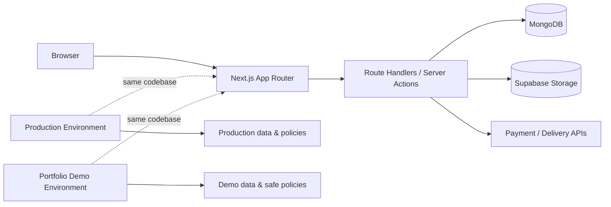

<p align="center">
  
</p>

# 도깨비테니스

**도깨비테니스**는 테니스 상품, 스트링 교체서비스, 라켓 대여, 패키지, 아카데미 신청, 주문·결제와 관리자 운영을 연결한 실서비스형 웹 플랫폼입니다. 고객 화면 몇 개를 나열하는 데 그치지 않고, 고객이 만든 주문과 신청이 운영자의 확인·처리 흐름으로 이어지도록 구현했습니다.

## Quick Links

| 링크 | 안내 |
| --- | --- |
| **[Portfolio Demo · 채용 담당자 체험 권장](https://demo.dokkaebitennis.com)** | 별도 Demo 데이터 환경에서 고객 플로우와 조회 전용 관리자 화면을 안전하게 체험합니다. |
| [Production](https://www.dokkaebitennis.com) | 실제 운영 사이트입니다. 테스트 데이터 생성이나 불필요한 조작은 권장하지 않습니다. |
| [Source](https://github.com/SeopE9611/SideProject/tree/main/TennisFlowShop) | `TennisFlowShop` 소스 코드입니다. |

## 3분 Demo Tour

Demo는 계정이나 관리자 password를 README에 노출하지 않고 시작할 수 있습니다.

1. [Demo 로그인 화면](https://demo.dokkaebitennis.com/login)에 접속합니다.
2. **고객 데모 체험 시작**을 선택합니다.
3. 상품 탐색·주문, 교체서비스, 대여, 패키지, 아카데미 등 고객 화면을 체험합니다.
4. 고객 화면에서 **관리자 데모 보기**를 선택합니다.
5. 관리자 **Operations** 통합 목록과 주문·신청·대여·패키지 상세 화면을 확인합니다.

### 안전한 체험을 위한 정책

- **고객 Demo는 interactive 환경입니다.** 고객 플로우에서 생성한 데이터는 임시 데이터이며 24시간 후 자동 정리됩니다.
- **관리자 Demo는 조회 전용입니다.** 화면에서 상태 변경 등 mutation UI를 제한하고, 서버에서도 관리자 `POST`·`PUT`·`PATCH`·`DELETE` 요청을 차단합니다.
- **실제 결제는 비활성화됩니다.** Portfolio Demo의 payment request는 서버에서 차단되며 외부 결제나 알림이 발생하지 않습니다.
- **데이터 출처를 표시합니다.** 관리자 화면의 **샘플 데이터**, **내 체험 데이터**, **체험 데이터** Badge로 미리 준비된 운영 예시, 현재 사용자가 만든 데이터, 그 밖의 임시 체험 데이터를 구분합니다.

### Production과 Portfolio Demo의 차이

| 항목 | Production | Portfolio Demo |
| --- | --- | --- |
| 목적 | 실제 서비스 운영 | 포트폴리오 기능 체험 |
| 고객 기능 | 실제 운영 흐름 | 별도 환경에서 상호작용 가능 |
| 관리자 | 실제 운영 권한과 정책 적용 | 조회 전용, mutation UI 및 서버 요청 제한 |
| 결제 | 운영 정책에 따른 NICE Pay 웹 결제 | 실제 결제 요청 차단 |
| 데이터 | 운영 데이터 | 분리된 Demo 데이터 |
| 체험 데이터 | 해당 없음 | 생성 후 24시간이 지나면 정리 |

Production과 Demo는 별도의 mock 화면을 유지하는 방식이 아니라 같은 코드베이스를 사용합니다. 실행 환경에 따라 데이터 연결과 결제·관리자 쓰기 정책을 분리해, 실제 고객 플로우에 가까운 체험과 운영 데이터 보호를 함께 다룹니다.

## 왜 만들었는가

테니스 매장 운영에서는 상품 판매, 스트링 작업, 라켓 대여, 패키지와 레슨뿐 아니라 주문 상태, 재고, 배송, 결제 정보가 서로 연결됩니다. 도깨비테니스는 이 업무를 독립된 페이지로만 구현하지 않고 **고객 행동 → 주문·신청 데이터 → 관리자 확인과 처리**로 이어지는 하나의 흐름으로 구성한 프로젝트입니다.

## 핵심 구현 영역

| 영역 | 구현 범위 |
| --- | --- |
| **Commerce** | 상품 목록·상세, 장바구니, 주문, NICE Pay 기반 웹 결제 흐름, 재고 확인 |
| **Stringing Service** | 스트링 교체서비스 신청, 예약 정보와 진행 상태, 상품 주문·라켓 대여 연계 |
| **Rental** | 라켓 대여, 배송·방문 수령, 수령·반납 처리, 연체 상태 표시 |
| **Package** | 패키지 구매, 이용권 상태, 사용·잔여 횟수 관리 |
| **Academy** | 클래스 안내와 신청, 별도 관리자 클래스·신청 관리 화면 |
| **Admin Operations** | 주문, 교체서비스 신청, 대여, 패키지 구매 통합 목록, 상태·결제 정보와 상세 조회, Demo 데이터 출처 Badge |
| **Community / Review** | 자유·장비 등 게시판, 댓글, 상품·서비스 이용 리뷰, 관리자 신고·리뷰 관리 |

> Admin Operations가 통합하는 종류는 `order`, `stringing_application`, `rental`, `package_purchase`입니다. Academy 신청은 Operations 종류에 섞지 않고 별도의 관리자 신청 관리 화면에서 다룹니다.

## Engineering Highlights

### 1. 고객과 관리자 데이터 흐름 연결

고객이 만든 주문, 교체서비스 신청, 대여와 패키지 구매가 관리자 목록과 상세 화면으로 이어집니다. 같은 상태 모델을 고객에게는 진행 정보로, 관리자에게는 처리할 업무와 결제·배송 정보로 다르게 제시합니다.

### 2. Admin Operations

운영자가 여러 메뉴를 반복해서 확인하지 않도록 주문, 교체서비스 신청, 대여, 패키지 구매를 하나의 통합 목록에서 조회하고 각 상세 화면으로 이동할 수 있게 구성했습니다. Academy는 별도의 관리자 클래스·신청 관리 흐름을 유지합니다.

### 3. 상호작용 가능한 Demo Sandbox

Production UI를 복제한 정적 mock이 아니라 같은 애플리케이션 코드에서 별도 Demo 데이터 환경을 사용합니다. 고객은 실제 플로우를 따라 임시 데이터를 만들 수 있고, 관리자는 그 결과와 준비된 운영 예시를 확인할 수 있습니다.

### 4. Admin Read-only Defense

조회 전용 정책을 버튼 숨김에만 의존하지 않습니다. 관리자 상세 화면의 mutation UI와 쓰기 전용 이동 경로를 제한하고, 서버 공통 경계에서는 Demo 환경의 `POST`, `PUT`, `PATCH`, `DELETE`를 `403`으로 차단합니다.

### 5. Demo Lifecycle과 결제 차단

Demo interaction 데이터에 24시간 수명을 적용하고 만료 데이터를 정리합니다. 결제 준비·요청 경로도 Demo 여부를 검사해 실제 payment request가 외부로 진행되지 않도록 막습니다.

### 6. 데이터 출처 분류

관리자 UX에서 미리 준비한 Seed 데이터, 현재 Demo session의 interaction, 그 밖의 interaction을 구분합니다. 내부 식별자를 화면에 노출하는 대신 **샘플 데이터**, **내 체험 데이터**, **체험 데이터** Badge로 의미를 전달합니다.

### 7. 품질 Gate

GitHub Actions는 Node.js 22 환경에서 lint → typecheck → build를 순차 실행합니다. 이어 관리자 타입 안전성, admin API boundary, core contract, critical admin smoke와 공지 충돌 재시도 E2E를 검사하고, Go/No-Go job에서 필수 결과를 판정합니다. 구현 문자열과 UI 문구 중심의 advisory contract는 별도 관찰 항목으로 실행합니다.

## Tech Stack

| 분류 | 기술 |
| --- | --- |
| Runtime / Framework | Node.js 22.x, Next.js 15.3.8 App Router, React 19.2.1 |
| Language / UI | TypeScript, Tailwind CSS, Radix UI |
| Data / Storage | MongoDB, Supabase Storage |
| Client State / Validation | SWR, Zustand, Zod |
| Payment | NICE Pay 기반 웹 결제 흐름 |
| Quality / Deployment | ESLint, Cypress, contract test scripts, GitHub Actions, Vercel |

웹 서비스의 현행 PG는 NICE Pay입니다. 관리자 주문 화면에서 Toss 계열 provider 값을 인식하는 코드는 과거 주문 표시 호환을 위한 것이며, 별도 [TossMiniApp](../TossMiniApp/README.md)의 Apps in Toss 결제 맥락을 현재 웹 PG와 혼합하지 않습니다.

## Architecture Snapshot


```mermaid
flowchart LR
  B[Browser] --> N[Next.js App Router]
  N --> R[Route Handlers / Server Actions]
  R --> M[(MongoDB)]
  R --> S[(Supabase Storage)]
  R --> E[Payment / Delivery APIs]

  P[Production Environment] -. same codebase .-> N
  D[Portfolio Demo Environment] -. same codebase .-> N
  P --> PD[Production data & policies]
  D --> DD[Demo data & safe policies]
```

- App Router 안에서 공개 고객 화면과 관리자 화면을 함께 관리합니다.
- Route Handler와 Server Action이 인증·정책을 확인하고 MongoDB, Storage 및 외부 API와 통신합니다.
- Production과 Demo는 같은 코드베이스를 사용하지만 데이터 환경과 관리자 쓰기·결제 정책은 분리합니다.

## Quality & Testing

대표적인 로컬·CI 검증 명령은 다음과 같습니다.

```bash
pnpm lint
pnpm typecheck
pnpm build
pnpm test:contract
pnpm test:contract:advisory
pnpm test:e2e:admin-critical
```

- **정적 품질:** ESLint와 추가 UI 정책 검사, 애플리케이션·Cypress TypeScript 검사, Next.js build
- **계약 검사:** 권한·CSRF·Demo read-only/interactive·도메인 상태·리뷰 정책 등을 core contract manifest로 관리
- **관리자 경계:** 관리자 타입 안전성 Gate와 관리자 화면/API 경계 검사
- **핵심 smoke:** production build 서버에서 권한·CSRF 중심의 critical admin smoke 실행
- **배포 판단:** 필수 job 결과를 Go/No-Go checklist와 관리자 경로 required gate에서 판정
- **Advisory 검사:** 구현 형태와 UI 문구 검사는 병합 차단 검증과 분리해 결과를 관찰

## Local Development

```bash
pnpm install
cp .env.example .env.local
pnpm dev
```

실제 secret은 저장소에 커밋하지 않습니다. 외부 연동이 필요한 기능은 로컬 환경에 필요한 값을 별도로 설정해야 합니다.

## What I Learned

- 고객 UI와 관리자 UI는 같은 상태 모델을 사용하더라도 서로 다른 정보 우선순위와 행동을 제공해야 합니다.
- 결제·배송처럼 외부 상태가 있는 기능은 단일 DB 값만으로 표시를 결정하지 않고 provider와 현재 처리 상태를 함께 해석해야 합니다.
- 포트폴리오 Demo는 정적인 read-only 복사본보다, 데이터와 외부 요청을 격리한 interactive sandbox일 때 실제 구현 흐름을 더 분명히 보여줄 수 있습니다.
- 관리자 read-only 정책은 UI 제한뿐 아니라 서버 mutation boundary에서도 강제해야 합니다.
- 과거 주문 데이터와 현재 provider·schema를 함께 다룰 때 명시적인 fallback과 표시 호환 정책이 필요합니다.

## Project Status

- Production: [www.dokkaebitennis.com](https://www.dokkaebitennis.com)
- 안전한 기능 체험: [demo.dokkaebitennis.com](https://demo.dokkaebitennis.com)
- 저장소 전체 안내: [SideProject Portfolio Hub](../README.md)

현재 웹 서비스와 Portfolio Demo는 같은 저장소에서 관리합니다. Production에서는 실제 운영 정책을 따르고, 기능 확인과 관리자 화면 탐색에는 데이터와 결제 정책이 분리된 Portfolio Demo 사용을 권장합니다.
